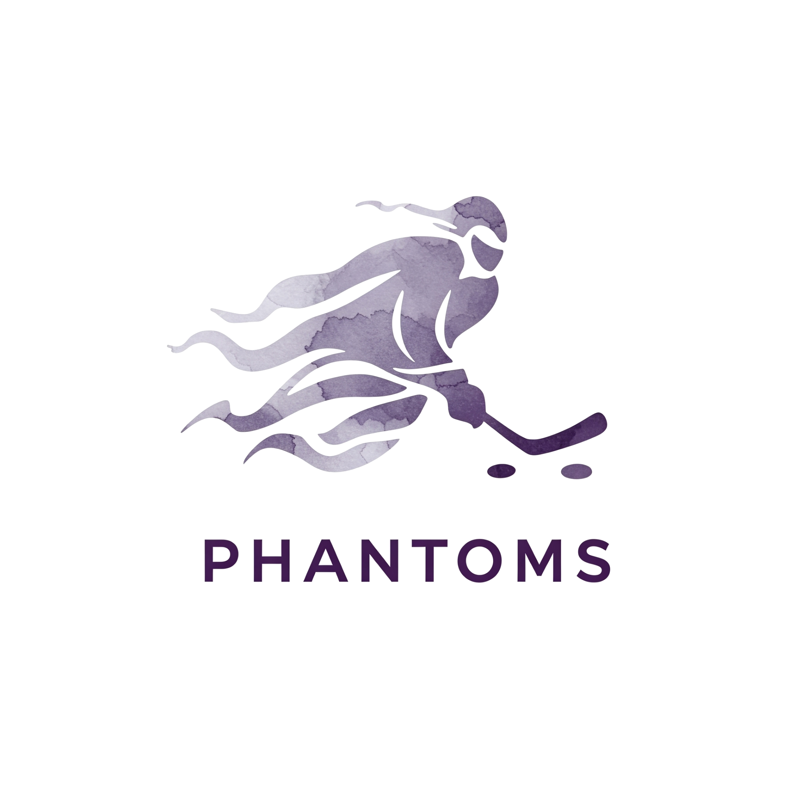

The Phantoms Hockey Hub is a small team website for keeping the season organized. It brings live SportNinja data, team reminders, and contact information into a clean documentation-style site.

::: {.brand-lockup}
{fig-alt="Phantoms skater logo"}
:::

## Site Goals

::: {.feature-grid .compact}
::: {.feature-card}
### Centralize

Keep schedule, standings, statistics, and recurring team notes in one place.
:::

::: {.feature-card}
### Clarify

Make the next useful action obvious for families checking the site from a phone.
:::

::: {.feature-card}
### Preserve

Keep a simple season history as information changes over time.
:::
:::

## Content To Add

Add the team story, league name, age group, rink details, coach or manager information, and any wording you want families to see when they first encounter the site.
