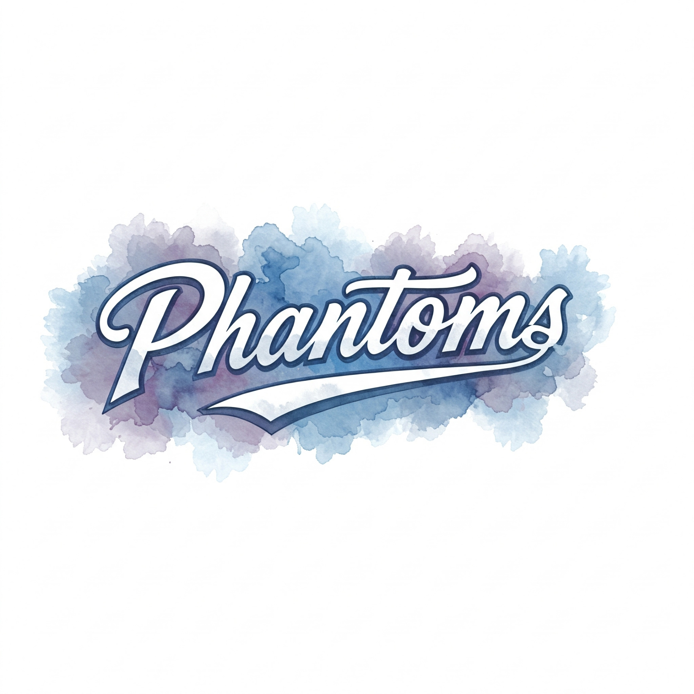

::: {.home-hero}
::: {.home-hero__shade}
:::
::: {.home-hero__content}

Phantoms hockey

# Follow the Phantoms all season.

Schedules, standings, player stats, announcements, and team information live here so families and players can find what they need before game day.

::: {.action-row}
[Team Center](team.qmd){.button .button-primary}
[Season Notes](season.qmd){.button .button-secondary}
:::
:::
:::

::: {.home-band}
::: {.content-wrap}

## Start Here

::: {.feature-grid}
::: {.feature-card}
### Team Center

Use the SportNinja-powered hub for current schedules, standings, stats, announcements, and results.

[Open team center](team.qmd){.text-link}
:::

::: {.feature-card}
### Season Details

Keep common season notes, rink information, uniform reminders, and update history in one place.

[View season page](season.qmd){.text-link}
:::

::: {.feature-card}
### Contact

Point families toward the right person for team questions, schedule changes, and corrections.

[Get in touch](contact.qmd){.text-link}
:::
:::

:::
:::

::: {.split-band}
::: {.content-wrap .split-layout}
::: {.split-copy}
## Built For Quick Checks

This site is intentionally direct: the live team data is one click away, key links stay in the navigation.

::: {.stat-strip}
::: {.stat-item}
01
Live team data
:::
::: {.stat-item}
02
Season notes
:::
::: {.stat-item}
03
Family updates
:::
:::
:::

::: {.split-media}
{fig-alt="Phantoms watercolor banner logo"}
:::
:::
:::
